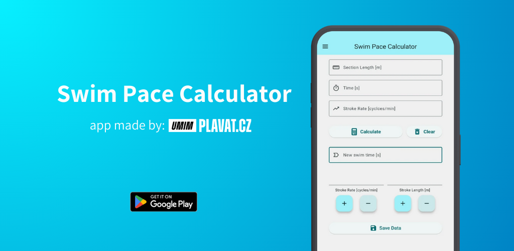
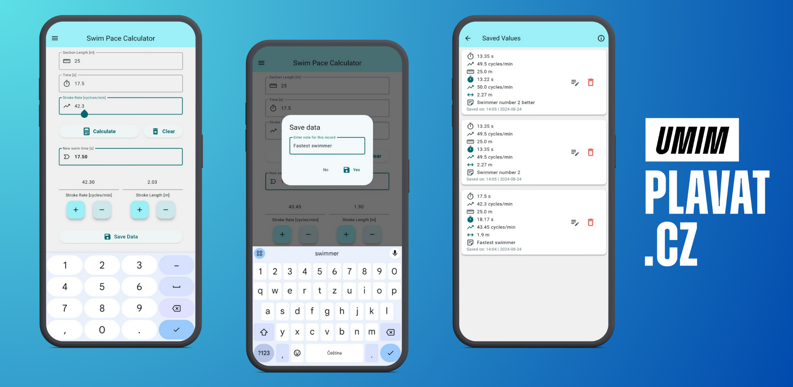

# Swim Pace Calculator

This app calculates how potential changes in two key performance parameters - **stroke rate (_SR_)** and **stroke length (_SL_)** - affect the average clean swim time.
**Swimming speed (_V_)** results from the optimal balance between **SR** and **SL** (_V = SR * SL_).

Users can adjust **SR** and **SL** values to estimate potential average changes in clean swim time. The app calculates a new swim time by varying one parameter (e.g., increasing SR) while keeping the other constant, or by varying both parameters.
This helps swimmers better understand how even small adjustments in **SR** or **SL** can significantly impact their swim times.

  

## How our app looks like?

  

## About the idea
**Original idea:** Raul Arellano

**Author:** [umimplavat.cz](https://umimplavat.cz/)

**Creator:** Vojtech Netrh
